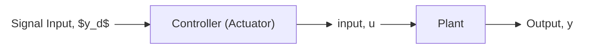

# Control Systems

## Links
[reference](https://www.egr.msu.edu/classes/me451/jchoi/2008/notes/)

[reading - Feedback Control Systems, C. L. Phillips and R. D.
Harbor](https://archive.org/details/feedbackcontrols0000phil_c6a4/page/n3/mode/2up)

## Prerequisites
1. Complex numbers
2. Logarithm
3. Laplace Transform
4. Dynamics

## What is "Control"?
- Make some object (called system, or plant) behave as we desire

Q: Why do we need control systems?
1. Convenient
2. Dangerous
3. Impossible for human (nanometer scale precision positioning)
4. They exist in nature 
5. Lower cost, high efficiency, etc.

Check Github Mermaid syntax
```mermaid
  info
```
## Open-Loop Control


- Calibration is the key!
- Can be sensitive to disturbances

## Closed-Loop (Feedback) Control
- Compare actual behaviour with desired behavior
- Make corrections based on the error
- The **sensor** and the **actuator** are key elements of a feedback loop
- Design control algorithm


